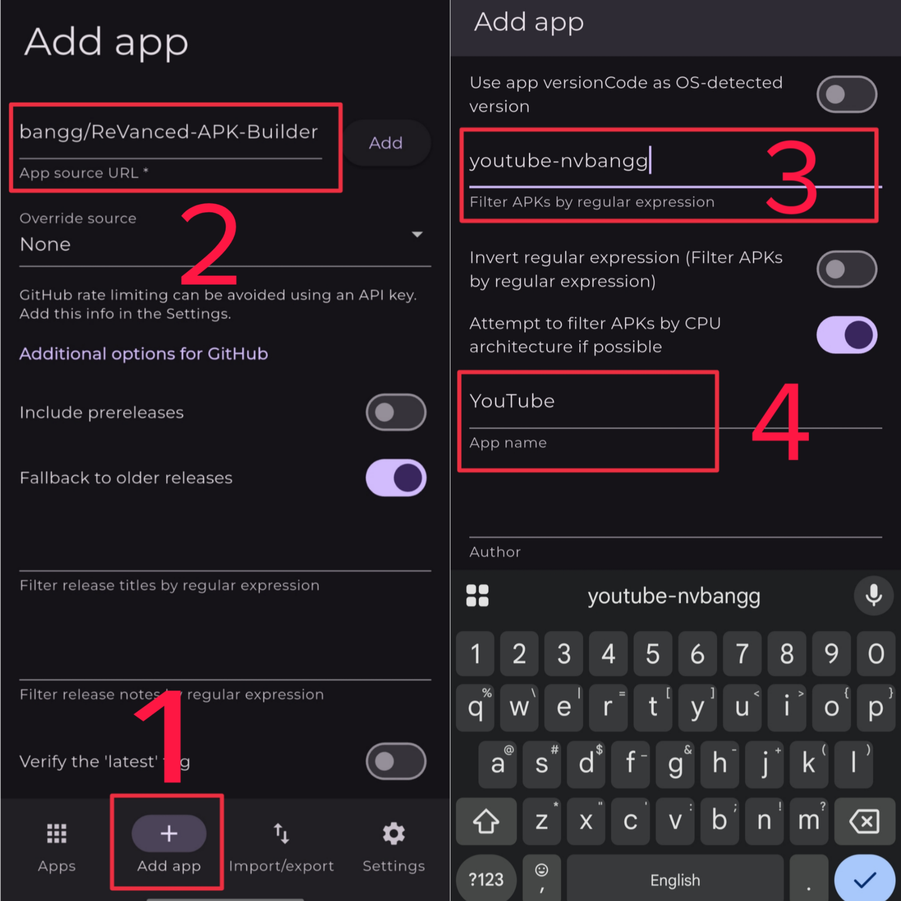

# 📱 Easily install and update apps with Obtainium:

## First, you need to download and install [Obtainium](https://github.com/ImranR98/Obtainium/releases) 

## How to add the app to Obtainium

### In step 2, Enter `https://github.com/nvbangg/Patches-APK-Builder`

### In step 3, Enter the expression for the app you want below:

- YouTube: `youtube-nvbangg`
- YouTube ReVanced: `youtube-revanced`
- YouTube Morphe: `youtube-morphe`

- YouTube Music: `youtube-music-nvbangg`
- YouTube Music ReVanced: `youtube-music-revanced`
- YouTube Music Morphe: `youtube-music-morphe`

- Google Photos: `google-photos`
- Spotify: `spotify`
- TikTok: `tiktok`
- Instagram: `instagram-revanced`
- Instagram ReVancedExperiments: `instagram-aunali321`
- Duolingo: `duolingo-hoo-dles`
- Duolingo ReVanced: `duolingo-hoo-dles`
- Facebook: `facebook`
- Messenger: `messenger`
- Telegram (CH Play): `telegram-aunali321`
- Telegram Web: `telegram-web-aunali321`
- X (Twitter): `twitter-revanced`
- X (Twitter) Piko: `twitter-crimera`
- Twitch: `twitch`
- Reddit: `reddit-revanced`
- Reddit Morphe: `reddit-morphe`
- Reddit Privacy Patches: `reddit-jkennethcarino`
- SoundCloud: `soundcloud`
- Viber: `viber`
- Threads: `threads-aunali321`
- Threads ReVanced: `threads-revanced`
- Gboard: `gboard`
- Google Recorder: `google-recorder`
- Prime Video: `prime-video`
- Disney+: `disney`
- Tumblr: `tumblr`
- Photomath: `photomath`
- Strava: `strava`
- MyFitnessPal: `myfitnesspal`
- Crunchyroll: `crunchyroll`
- Pandora: `pandora`
- Mega: `mega`
- Cake: `cake`
- Merriam Webster Dictionary: `merriam-webster-dictionary`
- Peacock TV: `peacock-tv`
- Cricbuzz: `cricbuzz`
- Pixiv: `pixiv`
- RAR: `rar`
- Proton Mail: `proton-mail`
- Proton VPN: `proton-vpn`
- AZ Screen Recorder: `az-screen-recorder`
- Nova Launcher: `nova-launcher`
- Tasker: `tasker`
- FX File Explorer: `fx-file-explorer`
- Solid Explorer: `solid-explorer`
- Smart Launcher 6: `smart-launcher`
- TickTick: `ticktick`
- Meme Generator: `meme-generator`
- Icon-Pack-Studio: `icon-pack-studio`
