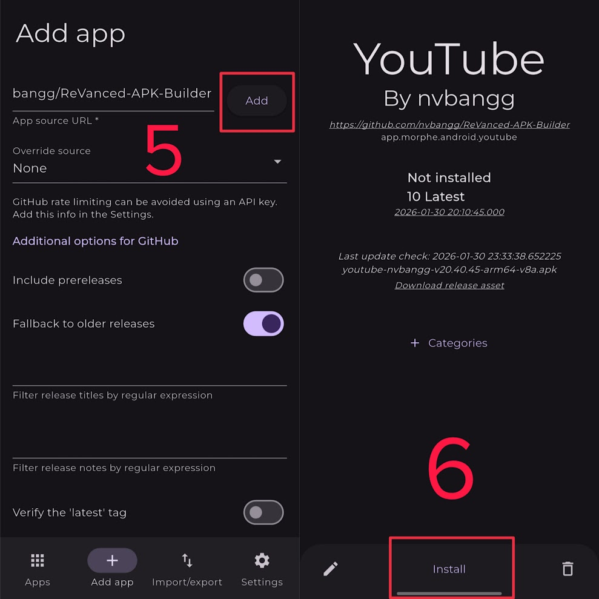

# 📱 Easily install and update apps with Obtainium:

## First, you need to download and install [Obtainium](https://github.com/ImranR98/Obtainium/releases) 

## How to add the app to Obtainium

### In step 2, Enter `https://github.com/nvbangg/Patches-APK-Builder`
### In step 3, Enter the expression for the app you want below:

- YouTube: `youtube-nvbangg`
- YouTube ReVanced: `youtube-revanced`
- YouTube Morphe: `youtube-morphe`

- YouTube Music: `youtube-music-nvbangg`
- YouTube Music ReVanced: `youtube-music-revanced`
- YouTube Music Morphe: `youtube-music-morphe`

- Google Photos: `google-photos-revanced`
- Spotify: `spotify-anddea`
- TikTok: `tiktok-revanced`
- Instagram: `instagram-revanced`
- Duolingo: `duolingo-revanced`
- Facebook: `facebook-revanced`
- Messenger: `messenger-revanced`
- Telegram (CH Play): `telegram-revanced-experiments`
- Telegram Web: `telegram-web-revanced-experiments`
- X (Twitter): `twitter-revanced`
- X (Twitter) Piko: `twitter-piko`
- Twitch: `twitch-revanced`
- Reddit: `reddit-revanced`
- Reddit RVX Morphed: `reddit-rvx-morphed`
- Reddit Privacy Patches: `reddit-privacy-patches`
- SoundCloud: `soundcloud-revanced`
- Viber: `viber-revanced`
- Prime Video: `prime-video-revanced`
- Disney+: `disney-revanced`
- Tumblr: `tumblr-revanced`
- Photomath: `photomath-revanced`
- Google Recorder: `google-recorder-revanced`
- Strava: `strava-revanced`
- MyFitnessPal: `myfitnesspal-revanced`
- Crunchyroll: `crunchyroll-revanced`
- Peacock TV: `peacock-tv-revanced`
- Cricbuzz: `cricbuzz-revanced`
- RAR: `rar-revanced`
- AZ Screen Recorder: `az-screen-recorder-scrazzz`
- Nova Launcher: `nova-launcher-dropped-patches`
- Proton Mail: `proton-mail-revanced`
- Proton VPN: `proton-vpn-revanced`
- Meme Generator: `meme-generator-revanced`
